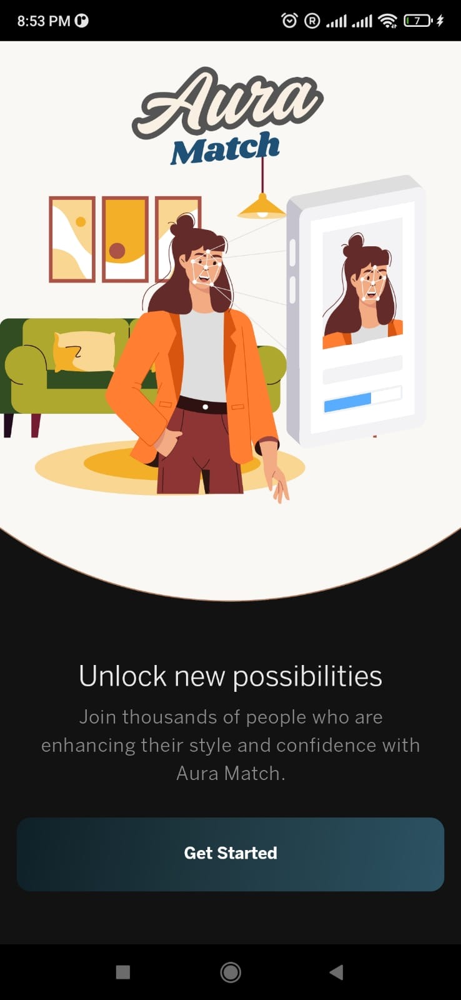
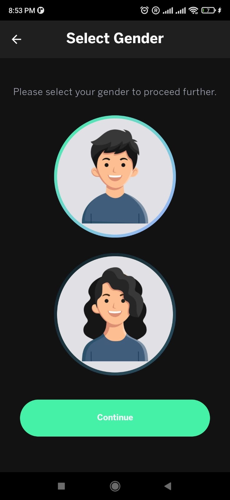
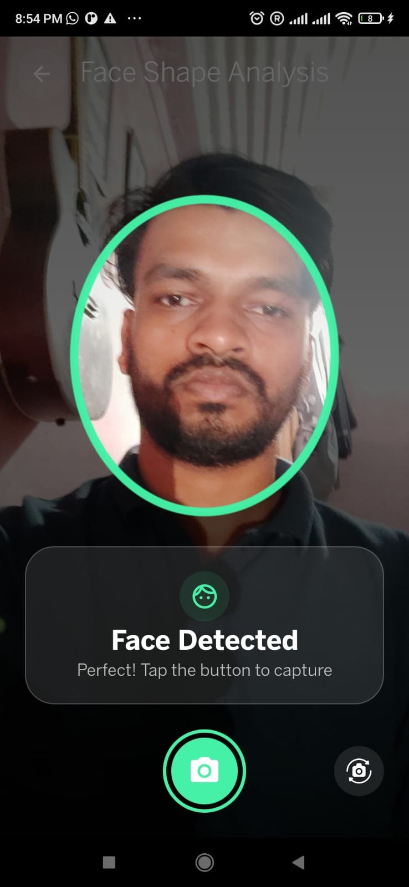
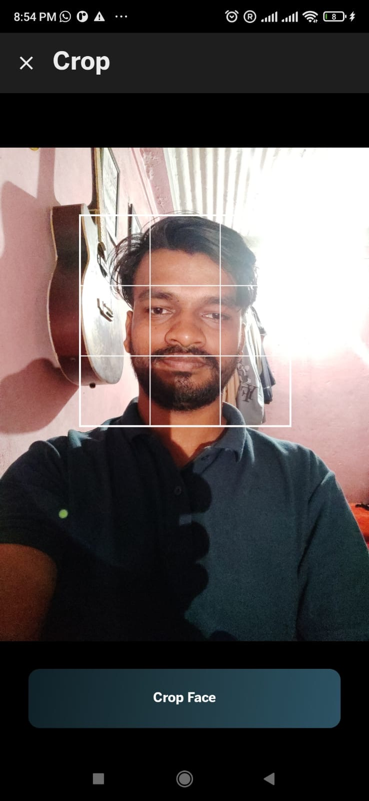
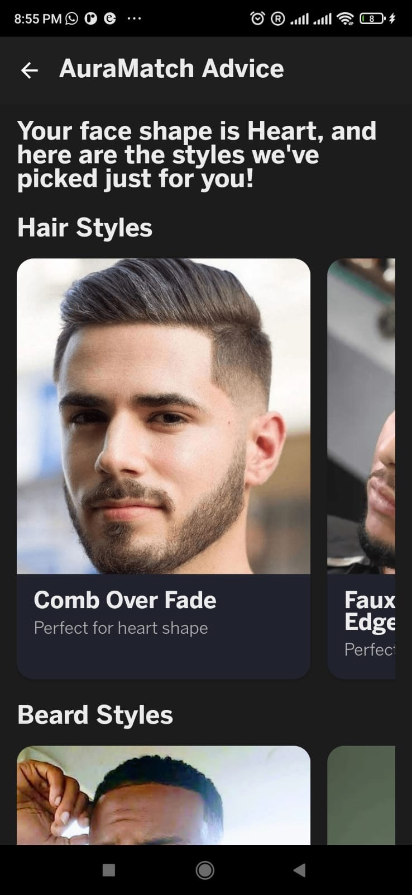
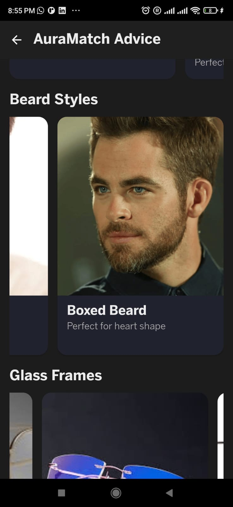
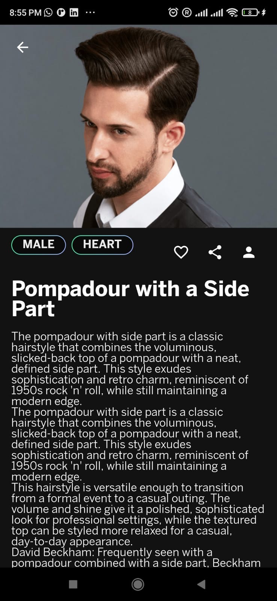

# 📱 AuraMatch-App

AuraMatch is an AI-powered Android application that recommends the best **hairstyles**, **beard styles**, and **glasses** based on your **face shape**. Using a real-time face scanner and an on-device machine learning model, the app provides personalized styling suggestions for both men and women.

---

## ✨ Features

- 📷 Real-time face scanning using the device camera  
- 🧠 On-device ML model (TensorFlow Lite) for face shape classification  
- 👨‍🎨 Style recommendations (hair, beard, glasses) with descriptions and images  
- 🧑‍🤝‍🧑 Works for both male and female users  
- 🔐 Fully offline face shape detection for privacy  

---

## 🚀 Installation

1. **Clone the repository**
   ```bash
   git clone https://github.com/yourusername/AuraMatch-App.git
   cd AuraMatch-App

2. **Open the project in Android Studio**
- Build & Run on a real device
- (Camera permissions and a real camera are required.)

## 📦 Requirements

- Android Studio Flamingo or later
- Kotlin
- Jetpack Compose
- TensorFlow Lite (included in assets/model.tflite)
- Minimum SDK 24+
## 🔗 Related Repositories

- 🧠 AuraMatch-Model – CNN-based face shape classifier (trained and converted to .tflite)
- 🌐 AuraMatch-Backend – Backend services for user profiles or extended features (optional)
## 📸 Screenshots

 
  


## 🛠️ Technologies Used

- Jetpack Compose – Modern UI toolkit for Android
- CameraX – Camera integration
- TensorFlow Lite – On-device ML model for face classification
- Kotlin – App development
## 📄 License

This project is licensed under the MIT License - see the LICENSE file for details.

## 🙌 Credits

- Developed by Rohan Shah
- Dataset from Kaggle (preprocessed and trained separately)
## 💡 Future Improvements

- Add AR-based preview for hairstyles
- User profile and history sync
- Customization of recommendations
